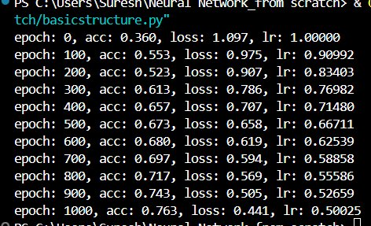
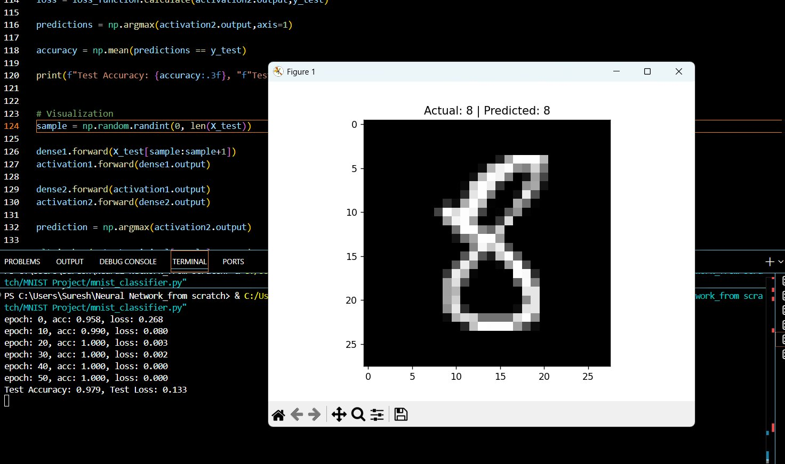
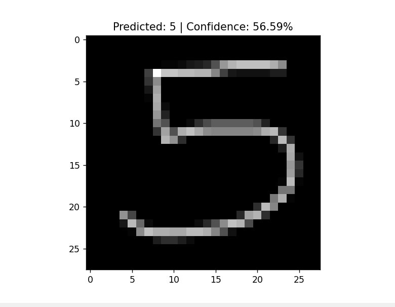

# MNIST Neural Network From Scratch

A neural network built entirely from scratch using only NumPy — no TensorFlow, no PyTorch, no high-level ML frameworks. Every component, from the forward pass to the optimizer, is implemented manually to demonstrate a ground-up understanding of how neural networks actually work.

---

## Overview

Most machine learning courses teach you to call `model.fit()` and move on. This project takes the opposite approach. Every layer, every activation function, every gradient calculation is written by hand, giving full visibility into the mechanics that frameworks usually hide.

The network is trained on the **MNIST dataset** — 70,000 images of handwritten digits (0–9) — and achieves a test accuracy of **97.4% – 98.2%** using a fully connected architecture with no convolutions.

---

## Screenshots

### Training Progress
> *Spiral dataset training — accuracy and loss over 1000 epochs*



### Predictions on Test Set
> *MNIST classifier predicting a handwritten digit from the test set*



### Custom Handwritten Digit Prediction
> *Model predicting a custom handwritten digit with confidence score*



---

## Architecture

The network is a fully connected (dense) feedforward neural network:

```
Input Layer       →  784 neurons (28×28 flattened image)
Hidden Layer 1    →  128 neurons  + ReLU Activation
Hidden Layer 2    →  64 neurons   + ReLU Activation
Output Layer      →  10 neurons   + Softmax Activation
```

The output layer produces a probability distribution over the 10 digit classes (0–9), and the predicted digit is the class with the highest probability.

---

## Features

### Layers
- **Dense (Fully Connected) Layers** — Each neuron connects to every neuron in the previous layer. Weights and biases are initialized and updated manually.

### Activations
- **ReLU (Rectified Linear Unit)** — Applied to hidden layers to introduce non-linearity; outputs `max(0, x)` and helps avoid the vanishing gradient problem.
- **Softmax** — Applied to the output layer to convert raw scores into a probability distribution across all 10 classes.

### Loss
- **Categorical Cross-Entropy Loss** — Measures the difference between the predicted probability distribution and the true one-hot encoded labels. Drives the optimization during training.

### Optimization
- **Backpropagation** — Gradients are computed analytically using the chain rule and propagated backwards through every layer to update weights.
- **Adam Optimizer** — Combines momentum and adaptive learning rates for faster, more stable convergence compared to vanilla gradient descent.
- **Mini-Batch Training** — Training data is split into small batches, balancing the stability of full-batch gradient descent with the speed of stochastic updates.

### Utilities
- **Model Weight Saving and Loading** — Trained weights are saved to disk so the model can be reloaded for inference without retraining.
- **Handwritten Digit Prediction** — A separate script accepts a custom image and runs it through the trained model to predict the digit.

---

## Results

| Metric | Value |
|---|---|
| Training Dataset | MNIST (60,000 images) |
| Test Dataset | MNIST (10,000 images) |
| Test Accuracy | **97.4% – 98.2%** |
| Optimizer | Adam |
| Architecture | Fully Connected (Dense) |

---

## Requirements

```
numpy
matplotlib
pillow
```

Install dependencies:

```bash
pip install numpy matplotlib pillow
```

---

## How to Run

### Train the Model
```bash
python mnist_classifier.py
```
This will train the network on the MNIST dataset, print loss and accuracy at each epoch, and save the trained weights to disk.

### Predict a Handwritten Digit
```bash
python predict_handwritten_digit.py
```
Provide a image of a handwritten digit (28×28 or larger) and the model will preprocess it and output a prediction.

---

## Project Structure

```
├── mnist_classifier.py          # Main training script
├── predict_handwritten_digit.py # Inference on custom images
├── model_weights/               # Saved weights after training
├── assets/                      # Screenshots and sample images
└── README.md
```

---

## Future Improvements

- [ ] Improved preprocessing pipeline for custom handwritten digit images
- [ ] Automatic digit centering and cropping for better inference on raw photos
- [ ] Convolutional Neural Network (CNN) implementation for higher accuracy
- [ ] Interactive drawing interface for real-time digit prediction in the browser

---

## Acknowledgements

Built by following and referencing **Harrison Kinsley's Neural Networks from Scratch** YouTube series and the accompanying GitHub repository — an invaluable resource for understanding neural networks at the lowest level.
